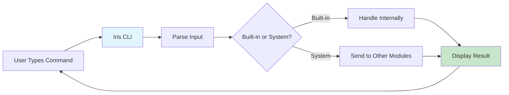
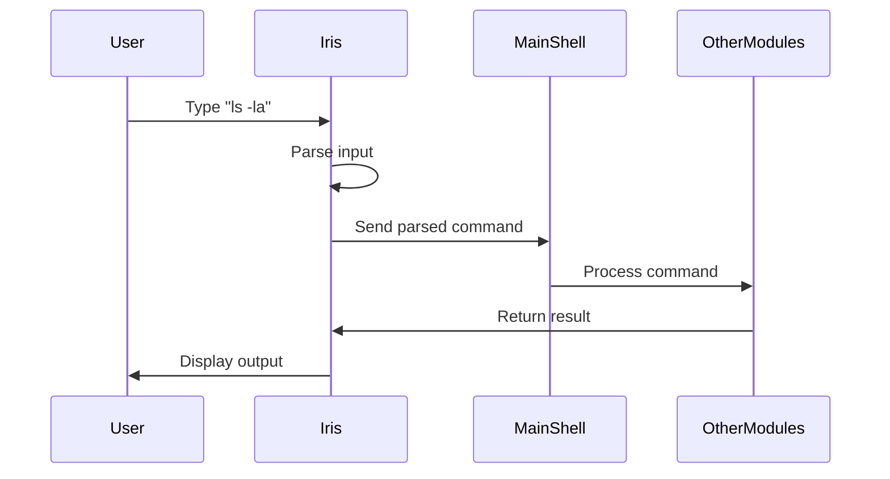

# Iris CLI Framework - Component Explanation

## 👤 Developer: Iris

---

## 📋 Overview

The **Iris CLI Framework** is the **user interface layer** of the Osiris shell. It's what the user sees and interacts with - the beautiful, colorful command-line interface that makes the shell easy to use.

**Think of it as:** The "face" of Osiris - the part that talks to the user.

---

## 🎯 Purpose

**What it does:**
- Shows the welcome message when you start Osiris
- Displays the prompt (`osiris>`) where you type commands
- Gets your input and understands what you want to do
- Shows results in a nice, colorful format
- Handles built-in commands like `help`, `exit`, `team`, etc.

**Why it's important:**
Without Iris's CLI Framework, you'd have no way to interact with the shell. It's like the keyboard and screen of your OS!

---

## 🏗️ Architecture



---

## 🔑 Key Components

### 1. **CLIFramework Class**
The main class that runs the shell interface.

```python
class CLIFramework:
    """Creates the command-line shell interface."""
```

**What it manages:**
- Shell name, version, prompt symbol
- Running state (is shell active?)
- Rich console for colorful output
- Current directory

---

### 2. **Main Methods**

#### `__init__(config)` - Setup
- Creates the Rich console for pretty output
- Sets shell name and version
- Configures the prompt symbol

#### `start()` - Main Loop
- Shows welcome message
- Continuously asks for user input
- Parses each command
- Yields commands to the main shell for processing

#### `_parse_input(user_input)` - Understanding Commands
- Splits input into command and arguments
- Example: `ls -la` becomes:
  - command: `ls`
  - args: `['-la']`
- Identifies if it's a built-in command

#### `handle_builtin(command, args)` - Built-in Commands
Handles special commands:
- `exit/quit` - Close the shell
- `help` - Show help message
- `team/status/metrics` - Passed to main shell

---

### 3. **Display Methods**

#### `display_output(output, style)`
Shows text in different colors:
- **info** → white (normal text)
- **success** → green (✓ success)
- **error** → red (✗ errors)
- **warning** → yellow (⚠ warnings)

#### `display_error(message)`
Shows errors in red with "Error:" prefix

#### `display_success(message)`
Shows success messages with ✓ checkmark

---

## 📊 Data Flow



---

## 💡 Example Usage

### Starting the Shell
```python
cli = CLIFramework({
    'shell_name': 'Osiris',
    'version': '0.1.0',
    'prompt_symbol': 'osiris>'
})

for command in cli.start():
    # Process each command
    print(f"Got command: {command['raw']}")
```

### What User Sees
```
╔══════════════════════════════════════════╗
║                                          ║
║ Osiris v0.1.0                           ║
║ Intelligent Command-Line Operating Shell ║
║                                          ║
║ Type 'help' for assistance              ║
║                                          ║
╚══════════════════════════════════════════╝

osiris> ls
[Files displayed in color...]

osiris> help
[Help message displayed...]

osiris> exit
Goodbye!
```

---

## 🎨 Rich Library Features Used

### 1. **Console**
```python
self.console = Console()
```
- Enables colored output
- Supports emoji and Unicode
- Auto-formats text

### 2. **Prompt**
```python
Prompt.ask("[green]osiris>[/green] ")
```
- Gets user input with styled prompt
- Handles special characters

### 3. **Panel**
```python
Panel(welcome_text, box=box.DOUBLE)
```
- Creates beautiful boxes around text
- Used for welcome message

---

## 🔄 Command Parsing

**Input:** `"ls -la /home/user"`

**Output:**
```python
{
    'raw': 'ls -la /home/user',
    'command': 'ls',
    'args': ['-la', '/home/user'],
    'is_builtin': False
}
```

**Built-in Commands:** `exit`, `quit`, `help`, `team`, `status`, `metrics`

---

## 🛠️ Simple Code Examples

### Display Different Styles
```python
# Success message
cli.display_success("Command executed successfully!")
# Output: ✓ Command executed successfully! (in green)

# Error message
cli.display_error("File not found")
# Output: Error: File not found (in red)

# Warning
cli.display_output("High CPU usage", style='warning')
# Output: High CPU usage (in yellow)
```

### Handle Built-in Commands
```python
if command == 'exit':
    cli.console.print("[cyan]Goodbye![/cyan]")
    cli.running = False
elif command == 'help':
    cli._show_help()
```

---

## 📁 File Structure

```
iris_cli_framework/
├── __init__.py           # Module initialization
├── cli_interface.py      # Main CLI code (this component)
└── COMPONENT_EXPLANATION.md  # This file
```

---

## 🎯 Key Features

1. ✅ **Beautiful Output** - Uses Rich library for colorful text
2. ✅ **Easy Input** - Simple command parsing
3. ✅ **Built-in Commands** - Handles help, exit, etc.
4. ✅ **Error Handling** - Graceful Ctrl+C and EOF handling
5. ✅ **Extensible** - Easy to add new display methods

---

## 🔗 Integration with Other Modules

### Works With:
- **Main Shell** (`osiris_team.py`) - Sends parsed commands
- **Safety Gate** (Kshitij) - Displays security warnings
- **System Monitor** (Prabal) - Shows performance metrics
- **Command Executor** (Shiv) - Displays command output

### What Iris Provides to Others:
- Parsed command dictionaries
- Formatted output methods
- User interaction handling

### What Iris Receives from Others:
- Command execution results
- System status information
- Error messages to display

---

## 📈 Complexity Level

**Beginner-Friendly Rating:** ⭐⭐⭐⭐⭐ (5/5)

**Why it's easy to understand:**
- Simple class structure
- Clear method names
- Lots of comments
- No complex algorithms
- Uses familiar concepts (input/output)

**Total Lines:** ~200 lines (very manageable!)

---

## 🚀 Future Enhancements

Potential improvements:
1. **Autocomplete** - Tab completion for commands
2. **Command History** - Arrow keys to browse history
3. **Syntax Highlighting** - Color code commands as you type
4. **Themes** - Different color schemes
5. **Multi-line Input** - Support for long commands

---

## 🎓 Learning Resources

To understand this component better, learn about:
- **Python Classes** - Object-oriented programming
- **Generator Functions** - The `yield` keyword
- **Rich Library** - Terminal formatting
- **String Manipulation** - `.split()`, `.strip()`
- **Dictionaries** - Data structures for commands

---

## ✨ Summary

**Iris CLI Framework = The User Interface**

| Aspect | Description |
|--------|-------------|
| **Input** | User commands from keyboard |
| **Process** | Parse and identify command type |
| **Output** | Beautiful, colorful terminal display |
| **Role** | Bridge between user and system |
| **Complexity** | Low (beginner-friendly) |
| **Lines of Code** | ~200 |
| **Dependencies** | Rich library |

**In One Sentence:**
Iris CLI Framework is the friendly face of Osiris that welcomes you, understands what you type, and shows you results in a beautiful, easy-to-read format! 🎨✨

---

*Component Owner: Iris*  
*Last Updated: October 13, 2025*  
*Difficulty: Beginner*  
*Status: Simplified & Production-Ready* ✅
