# Kshitij Safety Gate - Component Explanation

## 🛡️ Developer: Kshitij

---

## 📋 Overview

The **Kshitij Safety Gate** is the **security guardian** of the Osiris shell. It's like a bouncer at a club - it checks every command before it runs and blocks dangerous ones that could harm your system.

**Think of it as:** The protective shield that keeps you safe from accidental disasters.

---

## 🎯 Purpose

**What it does:**
- Analyzes every command before execution
- Calculates risk level (LOW, MEDIUM, HIGH, CRITICAL)
- Blocks or warns about dangerous commands
- Prevents accidental system damage
- Logs security decisions for review

**Why it's important:**
Without Kshitij's Safety Gate, a simple typo like `rm -rf /` could delete your entire system! It's the difference between a safe shell and a dangerous one.

---

## 🏗️ Architecture

```mermaid
graph TD
    A[Command Input] --> B[Safety Gate]
    B --> C{Analyze Command}
    C --> D[Check Critical Ops]
    C --> E[Check Dangerous Patterns]
    C --> F[Check System Paths]
    C --> G[Check Resource Impact]
    
    D --> H{Risk Level?}
    E --> H
    F --> H
    G --> H
    
    H -->|LOW| I[✓ Allow]
    H -->|MEDIUM| J[⚠ Warn + Allow]
    H -->|HIGH| K[⚠⚠ Require Confirmation]
    H -->|CRITICAL| L[✗ Block]
    
    style B fill:#ffebee
    style L fill:#f44336,color:#fff
    style I fill:#c8e6c9
```



---

## 🔑 Key Components

### 1. **SafetyGate Class**
The main security analyzer that evaluates every command.

```python
class SafetyGate:
    """Evaluates commands for safety before execution."""
```

**What it manages:**
- Risk threshold (how cautious to be)
- Critical command patterns
- Dangerous path patterns
- Security logs

---

## 🚨 Risk Levels Explained

### 1. **LOW** 🟢 - Safe Commands
- **Risk Score:** 0-3
- **Action:** Execute immediately
- **Examples:**
  ```
  ls
  pwd
  echo "hello"
  cat file.txt
  ```
- **Why safe:** Read-only operations, no system changes

### 2. **MEDIUM** 🟡 - Caution Needed
- **Risk Score:** 4-6
- **Action:** Show warning, then execute
- **Examples:**
  ```
  mkdir newfolder
  touch file.txt
  chmod 644 file.txt
  ```
- **Why cautious:** Makes changes but limited scope

### 3. **HIGH** 🟠 - Dangerous Commands
- **Risk Score:** 7-9
- **Action:** Require user confirmation
- **Examples:**
  ```
  rm file.txt
  kill process
  shutdown
  ```
- **Why dangerous:** Can delete data or stop processes

### 4. **CRITICAL** 🔴 - Blocked Commands
- **Risk Score:** 10+
- **Action:** Block completely
- **Examples:**
  ```
  rm -rf /
  format C:
  dd if=/dev/zero of=/dev/sda
  ```
- **Why blocked:** Can destroy entire system!

---

## 🔍 How Risk is Calculated


---

## 🔑 Key Methods

### 1. **`evaluate_command(command)`** - Main Security Check
```python
def evaluate_command(self, command):
    """
    Analyzes command and returns safety assessment.
    
    Returns:
        dict: {
            'safe': True/False,
            'risk_level': 'LOW/MEDIUM/HIGH/CRITICAL',
            'risk_score': 0-10,
            'reasons': ['why it's risky'],
            'recommendation': 'what to do'
        }
    """
```

**Process:**
1. Start with risk score = 0
2. Check if command is critical → Add 10 points
3. Check for dangerous patterns → Add 3-5 points
4. Check for system paths → Add 2 points
5. Check resource impact → Add 1 point
6. Calculate final risk level
7. Return detailed assessment

---

### 2. **`_is_critical_command(command)`** - Critical Check
Detects extremely dangerous commands:

```python
critical_operations = [
    'rm -rf /',        # Delete everything
    'format',          # Format disk
    'mkfs',            # Make filesystem (destroys data)
    'dd',              # Disk duplicator (can wipe drives)
    ':(){ :|:& };:',   # Fork bomb (crashes system)
]
```

**Returns:** `True` if command is critical, `False` otherwise

---

### 3. **`_has_dangerous_patterns(command)`** - Pattern Check
Looks for risky command patterns:

```python
dangerous_patterns = [
    'rm ',             # Delete files
    'kill',            # Kill processes
    'shutdown',        # Turn off system
    'reboot',          # Restart system
    'chmod 777',       # Make everything writable
    'chown',           # Change file owner
    '> /dev/',         # Write to device files
]
```

**Returns:** List of found dangerous patterns

---

### 4. **`_affects_system_paths(command)`** - Path Check
Checks if command touches critical system directories:

```python
system_paths = [
    '/etc/',           # System configuration
    '/bin/',           # Essential programs
    '/boot/',          # Boot files
    '/dev/',           # Device files
    '/sys/',           # System files
    'C:\\Windows\\',   # Windows system folder
]
```

**Returns:** `True` if affects system paths

---

### 5. **`_is_resource_intensive(command)`** - Resource Check
Identifies commands that use lots of CPU/memory:

```python
intensive_commands = [
    'find /',          # Search entire filesystem
    'du -sh /',        # Calculate disk usage
    'grep -r',         # Recursive search
    'tar',             # Archive creation
    'zip',             # Compression
]
```

**Returns:** `True` if resource-intensive

---

## 💡 Example Evaluations

### Example 1: Safe Command ✅
```python
command = "ls -la"
result = safety_gate.evaluate_command(command)

# Result:
{
    'safe': True,
    'risk_level': 'LOW',
    'risk_score': 0,
    'reasons': [],
    'recommendation': 'Safe to execute'
}
```

### Example 2: Medium Risk ⚠️
```python
command = "mkdir /tmp/test"
result = safety_gate.evaluate_command(command)

# Result:
{
    'safe': True,
    'risk_level': 'MEDIUM',
    'risk_score': 4,
    'reasons': ['Modifies filesystem'],
    'recommendation': 'Proceed with caution'
}
```

### Example 3: High Risk ⚠️⚠️
```python
command = "rm important_file.txt"
result = safety_gate.evaluate_command(command)

# Result:
{
    'safe': True,
    'risk_level': 'HIGH',
    'risk_score': 8,
    'reasons': ['Uses dangerous command: rm', 'Deletes files'],
    'recommendation': 'Confirm before executing'
}
```

### Example 4: Critical - Blocked 🛑
```python
command = "rm -rf /"
result = safety_gate.evaluate_command(command)

# Result:
{
    'safe': False,
    'risk_level': 'CRITICAL',
    'risk_score': 10,
    'reasons': ['CRITICAL: System-wide deletion', 'Affects root directory'],
    'recommendation': 'Command blocked for safety'
}
```

---

## 📊 Data Flow

```mermaid
sequenceDiagram
    participant User
    participant CLI
    participant SafetyGate
    participant Executor
    
    User->>CLI: Type "rm file.txt"
    CLI->>SafetyGate: Evaluate command
    SafetyGate->>SafetyGate: Calculate risk
    SafetyGate-->>CLI: Risk: HIGH
    CLI->>User: ⚠️ Confirm deletion?
    User->>CLI: Yes
    CLI->>Executor: Execute command
    Executor-->>User: File deleted
    
    Note over SafetyGate: If CRITICAL,<br/>blocked here
```



---

## 🛠️ Configuration

### Setting Risk Threshold
```python
# Cautious mode (blocks more)
safety_gate = SafetyGate(risk_threshold=5)

# Balanced mode (default)
safety_gate = SafetyGate(risk_threshold=7)

# Permissive mode (allows more)
safety_gate = SafetyGate(risk_threshold=9)
```

**Lower threshold** = More protective  
**Higher threshold** = More permissive

---

## 📁 File Structure

```
kshitij_safety_gate/
├── __init__.py               # Module initialization
├── safety_gate.py            # Main security code (this component)
└── COMPONENT_EXPLANATION.md  # This file
```

---

## 🎯 Key Features

1. ✅ **Four Risk Levels** - LOW, MEDIUM, HIGH, CRITICAL
2. ✅ **Pattern Matching** - Detects dangerous command patterns
3. ✅ **Path Protection** - Guards system directories
4. ✅ **Resource Awareness** - Identifies heavy operations
5. ✅ **Detailed Feedback** - Explains why commands are risky
6. ✅ **Configurable** - Adjustable risk threshold
7. ✅ **Logging** - Records all security decisions

---

## 🚨 Protected Against

### File System Disasters
```
❌ rm -rf /           # Delete everything
❌ format C:          # Format Windows drive
❌ mkfs /dev/sda      # Destroy partition
✓  rm old_file.txt    # Delete single file (with confirmation)
```

### System Crashes
```
❌ :(){ :|:& };:      # Fork bomb
❌ cat /dev/zero > /dev/sda  # Wipe disk
✓  shutdown -h now    # Normal shutdown (with confirmation)
```

### Permission Issues
```
❌ chmod 777 /etc     # Make system files writable
❌ chown nobody /bin  # Change ownership of binaries
✓  chmod 644 myfile   # Normal permission change
```

---

## 🔗 Integration with Other Modules

### Receives From:
- **Iris CLI** - Raw commands to evaluate
- **Main Shell** - Risk threshold configuration

### Sends To:
- **Main Shell** - Safety assessment results
- **Iris CLI** - Warning messages to display
- **Logger** - Security decision logs

### Protects:
- **Shiv's Executor** - Only safe commands reach execution
- **Your System** - Prevents catastrophic damage
- **User Data** - Stops accidental deletions

---

## 📈 Complexity Level

**Beginner-Friendly Rating:** ⭐⭐⭐⭐☆ (4/5)

**Why mostly easy:**
- Clear risk level system
- Simple pattern matching (no regex!)
- Lots of helpful comments
- Straightforward scoring logic

**Slightly complex part:**
- Multiple checking methods
- Risk calculation logic
- But still very readable!

**Total Lines:** ~310 lines

---

## 🚀 Future Enhancements

Potential improvements:
1. **Machine Learning** - Learn from user behavior
2. **Custom Rules** - User-defined dangerous patterns
3. **Whitelist** - Trusted commands bypass checks
4. **Sandbox Mode** - Test dangerous commands safely
5. **Undo Feature** - Rollback dangerous operations
6. **Context Awareness** - Risk varies by current directory

---

## 🎓 Learning Resources

To understand this component better, learn about:
- **String Methods** - `.startswith()`, `.contains()`, etc.
- **List Comprehensions** - Pattern checking
- **Dictionaries** - Return data structures
- **Conditional Logic** - If-else chains
- **Security Concepts** - Why commands are dangerous

---

## 📚 Common Dangerous Commands

| Command | Risk | Why Dangerous |
|---------|------|---------------|
| `rm -rf /` | CRITICAL | Deletes entire system |
| `format C:` | CRITICAL | Erases disk |
| `dd if=/dev/zero of=/dev/sda` | CRITICAL | Wipes hard drive |
| `chmod 777 /etc` | HIGH | Breaks system security |
| `kill -9 1` | HIGH | Kills init process |
| `shutdown now` | HIGH | Turns off computer |
| `rm file.txt` | MEDIUM | Deletes file (recoverable) |
| `mkdir folder` | LOW | Just creates folder |
| `ls` | LOW | Just lists files |

---

## ✨ Summary

**Kshitij Safety Gate = The Security Guardian**

| Aspect | Description |
|--------|-------------|
| **Input** | Command string to evaluate |
| **Process** | Calculate risk score (0-10+) |
| **Output** | Safety assessment with recommendations |
| **Role** | Prevent system damage |
| **Complexity** | Medium (pattern matching) |
| **Lines of Code** | ~310 |
| **Protection** | File system, processes, system files |

**In One Sentence:**
Kshitij Safety Gate is your vigilant security guard that analyzes every command for danger, blocks catastrophic operations, and warns you about risky actions before they damage your system! 🛡️🔒

---

## 🎯 Real-World Example

```
User types: rm -rf /
         ↓
┌─────────────────────┐
│  Kshitij Checks:    │
│  ✓ Critical command │
│  ✓ System path      │
│  ✓ Recursive delete │
│  → Risk: CRITICAL   │
└─────────────────────┘
         ↓
🛑 BLOCKED!
Error: This command could delete your entire system!
Recommendation: Command blocked for safety

User types: ls -la
         ↓
┌─────────────────────┐
│  Kshitij Checks:    │
│  ✗ Not critical     │
│  ✗ No danger        │
│  ✗ Read-only        │
│  → Risk: LOW        │
└─────────────────────┘
         ↓
✓ ALLOWED!
[files listed...]
```

---

*Component Owner: Kshitij*  
*Last Updated: October 14, 2025*  
*Difficulty: Beginner-Intermediate*  
*Status: Simplified & Production-Ready* ✅  
*Security Level: High Protection* 🛡️
