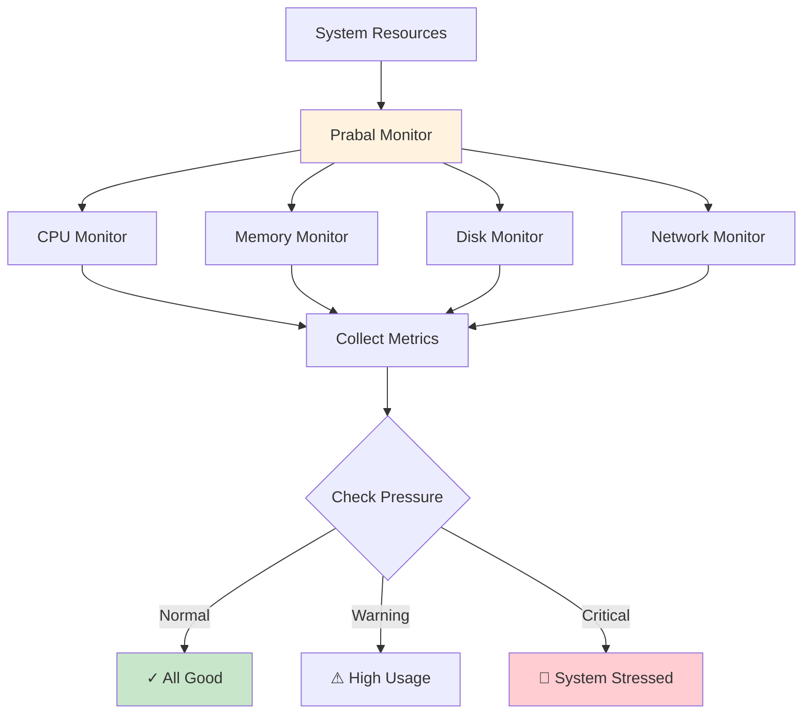
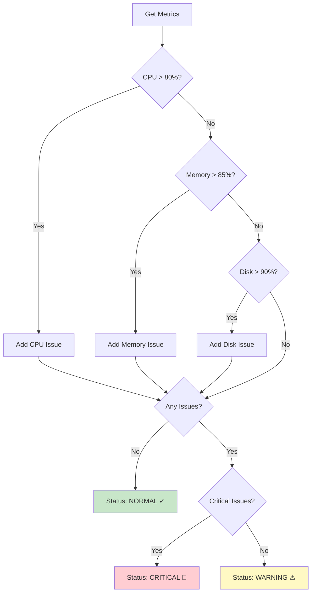
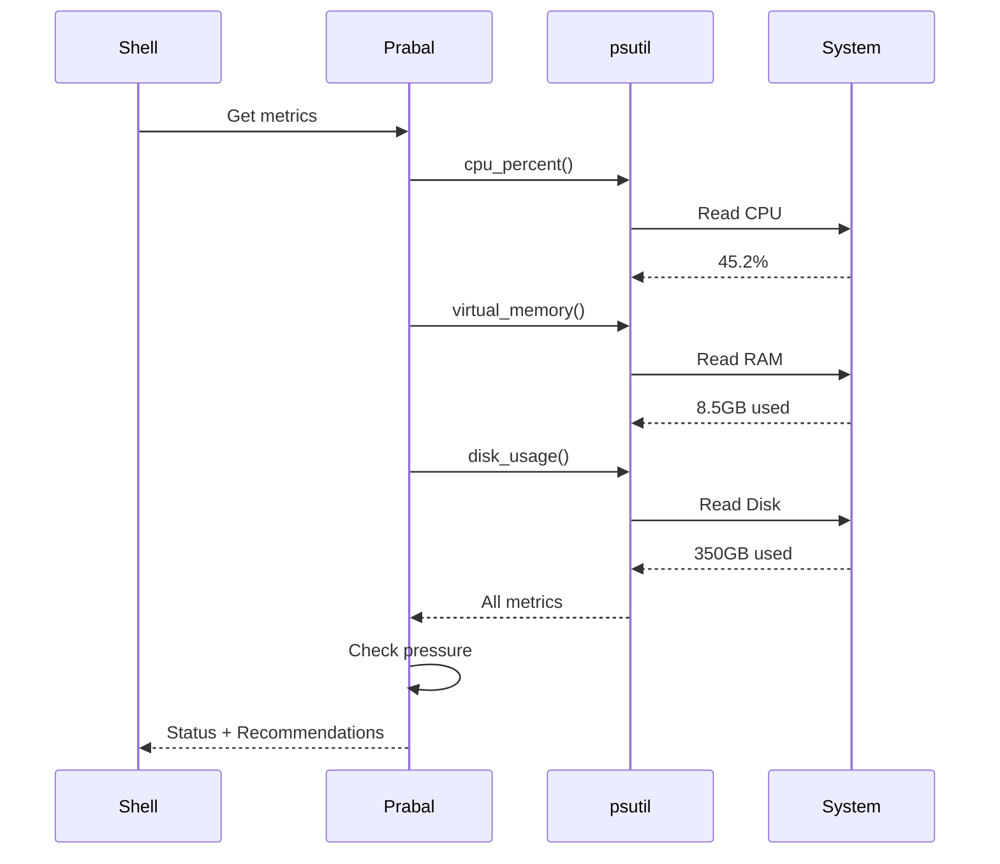

# Prabal Efficiency Metrics - Component Explanation

## 📊 Developer: Prabal

---

## 📋 Overview

The **Prabal Efficiency Metrics** component is the **performance monitor** of the Osiris shell. It's like the dashboard in your car - constantly watching CPU, memory, disk, and network usage to keep the system running smoothly.

**Think of it as:** The health monitor that tells you when your computer is working too hard.

---

## 🎯 Purpose

**What it does:**
- Monitors CPU usage in real-time
- Tracks memory (RAM) consumption
- Watches disk space and I/O
- Monitors network activity
- Detects resource pressure (when system is struggling)
- Provides performance recommendations

**Why it's important:**
Without Prabal's monitoring, you wouldn't know if a command is freezing your system, eating all your RAM, or filling up your disk. It's essential for keeping Osiris efficient!

---

## 🏗️ Architecture



---

## 🔑 Key Components

### 1. **SystemMonitor Class**
The main class that tracks all system resources.

```python
class SystemMonitor:
    """Monitors system resources and performance metrics."""
```

**What it tracks:**
- CPU percentage
- Memory usage (used/available/percent)
- Disk usage (used/free/percent)
- Network I/O (bytes sent/received)
- Process count

---

## 📊 Metrics Explained

### 1. **CPU Metrics** 🖥️
```python
{
    'cpu_percent': 45.2,           # Current CPU usage
    'cpu_count': 8,                # Number of CPU cores
    'cpu_per_core': [35, 50, 40, ...],  # Usage per core
}
```

**What it means:**
- **0-30%** = Light usage (system relaxed)
- **30-70%** = Moderate usage (normal work)
- **70-90%** = High usage (system working hard)
- **90-100%** = Critical (system overloaded)

---

### 2. **Memory Metrics** 💾
```python
{
    'memory_total': 16.0,          # Total RAM in GB
    'memory_used': 8.5,            # Used RAM in GB
    'memory_available': 7.5,       # Free RAM in GB
    'memory_percent': 53.1,        # Usage percentage
}
```

**What it means:**
- **0-50%** = Plenty of memory
- **50-75%** = Moderate usage
- **75-90%** = High usage (may slow down)
- **90-100%** = Critical (system swapping)

---

### 3. **Disk Metrics** 💿
```python
{
    'disk_total': 500.0,           # Total disk space in GB
    'disk_used': 350.0,            # Used space in GB
    'disk_free': 150.0,            # Free space in GB
    'disk_percent': 70.0,          # Usage percentage
    'disk_read_mb': 1250.5,        # Data read since boot
    'disk_write_mb': 890.2,        # Data written since boot
}
```

**What it means:**
- **0-70%** = Plenty of space
- **70-85%** = Getting full
- **85-95%** = Low space (clean up soon)
- **95-100%** = Critical (system may crash)

---

### 4. **Network Metrics** 🌐
```python
{
    'network_sent_mb': 450.5,      # Data uploaded in MB
    'network_recv_mb': 1200.8,     # Data downloaded in MB
    'network_total_mb': 1651.3,    # Total network traffic
}
```

**What it tracks:**
- Total bytes sent/received
- Helps identify network-heavy operations
- Useful for monitoring downloads/uploads

---

## 🔑 Key Methods

### 1. **`get_current_metrics()`** - Snapshot
```python
def get_current_metrics(self):
    """
    Gets current system performance snapshot.
    
    Returns:
        dict: Complete system metrics including CPU, 
              memory, disk, and network usage.
    """
```

**What it does:**
1. Reads CPU usage with `psutil.cpu_percent()`
2. Gets memory info with `psutil.virtual_memory()`
3. Checks disk with `psutil.disk_usage('/')`
4. Reads network I/O with `psutil.net_io_counters()`
5. Counts processes with `psutil.pids()`
6. Returns everything in one dictionary

**When to use:** Anytime you want a health check

---

### 2. **`check_resource_pressure()`** - Health Status
```python
def check_resource_pressure(self):
    """
    Determines if system is under resource pressure.
    
    Returns:
        dict: {
            'status': 'normal/warning/critical',
            'issues': ['what's wrong'],
            'recommendations': ['what to do']
        }
    """
```

**How it works:**
```python
# Check each resource
if cpu > 80%:
    issues.append("High CPU usage")
if memory > 85%:
    issues.append("High memory usage")
if disk > 90%:
    issues.append("Low disk space")

# Determine overall status
if critical_issues:
    status = 'critical'
elif any_issues:
    status = 'warning'
else:
    status = 'normal'
```

**Returns 3 statuses:**
- **normal** 🟢 - All good, system healthy
- **warning** 🟡 - Some resources high, watch out
- **critical** 🔴 - System struggling, take action!

---

### 3. **`get_process_list()`** - Running Processes
```python
def get_process_list(self, limit=10):
    """
    Gets list of running processes sorted by resource usage.
    
    Returns:
        list: Top processes with PID, name, CPU%, memory%
    """
```

**Example output:**
```python
[
    {'pid': 1234, 'name': 'chrome', 'cpu': 25.5, 'memory': 15.2},
    {'pid': 5678, 'name': 'python', 'cpu': 10.2, 'memory': 8.5},
    {'pid': 9012, 'name': 'vscode', 'cpu': 8.1, 'memory': 12.0},
]
```

**Use case:** Find what's slowing down your system

---

### 4. **`log_metrics()`** - History Tracking
```python
def log_metrics(self):
    """
    Records current metrics to log file for historical analysis.
    """
```

**Creates log entry:**
```
2025-10-14 10:30:45 | CPU: 45.2% | Memory: 53.1% | Disk: 70.0%
```

**Benefits:** Track performance over time, spot trends

---

## 💡 Example Usage

### Example 1: Get System Health
```python
monitor = SystemMonitor()
metrics = monitor.get_current_metrics()

print(f"CPU: {metrics['cpu_percent']}%")
print(f"Memory: {metrics['memory_percent']}%")
print(f"Disk: {metrics['disk_percent']}%")

# Output:
# CPU: 45.2%
# Memory: 53.1%
# Disk: 70.0%
```

---

### Example 2: Check for Problems
```python
pressure = monitor.check_resource_pressure()

if pressure['status'] == 'critical':
    print("⚠️ System under heavy load!")
    for issue in pressure['issues']:
        print(f"  - {issue}")
    for rec in pressure['recommendations']:
        print(f"  → {rec}")

# Output if CPU is high:
# ⚠️ System under heavy load!
#   - High CPU usage (92.5%)
#   → Close unnecessary applications
#   → Check for runaway processes
```

---

### Example 3: Find Resource Hogs
```python
processes = monitor.get_process_list(limit=5)

print("Top 5 processes by CPU usage:")
for proc in processes:
    print(f"{proc['name']}: {proc['cpu']}% CPU, {proc['memory']}% Memory")

# Output:
# Top 5 processes by CPU usage:
# chrome: 25.5% CPU, 15.2% Memory
# python: 10.2% CPU, 8.5% Memory
# vscode: 8.1% CPU, 12.0% Memory
# spotify: 5.3% CPU, 4.2% Memory
# slack: 3.8% CPU, 6.1% Memory
```

---

## 📊 Resource Pressure Detection



---

## 🎯 Thresholds Table

| Resource | Normal | Warning | Critical | Action Needed |
|----------|--------|---------|----------|---------------|
| **CPU** | 0-70% | 70-85% | 85-100% | Close apps, kill processes |
| **Memory** | 0-75% | 75-90% | 90-100% | Free up RAM, restart apps |
| **Disk** | 0-80% | 80-95% | 95-100% | Delete files, clean up |
| **Processes** | <150 | 150-300 | 300+ | Kill unnecessary processes |

---

## 📊 Data Flow



---

## 🛠️ Simple Code Walkthrough

### How CPU Monitoring Works
```python
# 1. Get CPU percentage
cpu_percent = psutil.cpu_percent(interval=1)
# interval=1 means "measure over 1 second"

# 2. Get per-core usage
cpu_per_core = psutil.cpu_percent(percpu=True)
# percpu=True gives list like [35, 50, 40, 45, 38, 52, 41, 48]

# 3. Count cores
cpu_count = psutil.cpu_count()
# Returns number like 8 (for 8-core CPU)
```

### How Memory Monitoring Works
```python
# 1. Get memory info
mem = psutil.virtual_memory()

# 2. Extract details
total_gb = mem.total / (1024 ** 3)      # Convert bytes to GB
used_gb = mem.used / (1024 ** 3)
available_gb = mem.available / (1024 ** 3)
percent = mem.percent                    # Already a percentage

# 3. Return as dict
return {
    'memory_total': round(total_gb, 2),
    'memory_used': round(used_gb, 2),
    'memory_available': round(available_gb, 2),
    'memory_percent': percent
}
```

---

## 📁 File Structure

```
prabal_efficiency_metrics/
├── __init__.py               # Module initialization
├── system_monitor.py         # Main monitoring code (this component)
└── COMPONENT_EXPLANATION.md  # This file
```

---

## 🎯 Key Features

1. ✅ **Real-time Monitoring** - Live system stats
2. ✅ **Multi-resource Tracking** - CPU, Memory, Disk, Network
3. ✅ **Pressure Detection** - Warns when system struggling
4. ✅ **Process Listing** - Find resource hogs
5. ✅ **Historical Logging** - Track performance over time
6. ✅ **Smart Recommendations** - Tells you what to do
7. ✅ **Lightweight** - Uses minimal resources itself

---

## 📈 Use Cases in Osiris

### Before Running Commands
```python
# Check if system can handle it
pressure = monitor.check_resource_pressure()
if pressure['status'] == 'critical':
    print("⚠️ System overloaded! Consider waiting.")
else:
    execute_command()
```

### During Long Operations
```python
# Monitor while command runs
while command_running:
    metrics = monitor.get_current_metrics()
    if metrics['cpu_percent'] > 95:
        print("⚠️ High CPU! Command may take longer.")
    time.sleep(5)
```

### After Command Execution
```python
# Report impact
metrics_after = monitor.get_current_metrics()
print(f"Command used {metrics_after['cpu_percent']}% CPU")
```

---

## 🔗 Integration with Other Modules

### Provides To:
- **Main Shell** - System health status
- **Iris CLI** - Performance metrics to display
- **Safety Gate** - Resource availability info
- **Command Executor** - Pre-execution health check

### Uses:
- **psutil Library** - Cross-platform system monitoring
- **Python os module** - System information
- **Logging** - Historical data recording

### Helps Others:
- **Prevents Overload** - Warns before running heavy commands
- **Debugging** - Identify performance bottlenecks
- **User Feedback** - Show real-time system status

---

## 📈 Complexity Level

**Beginner-Friendly Rating:** ⭐⭐⭐⭐⭐ (5/5)

**Why it's easy:**
- Simple dictionary returns
- Clear method names
- No complex algorithms
- Just reading system values
- Lots of comments

**Total Lines:** ~180 lines

---

## 🚀 Future Enhancements

Potential improvements:
1. **Performance Graphs** - Visual charts of usage over time
2. **Alerts** - Email/notification when critical
3. **Predictive Analysis** - Forecast resource needs
4. **GPU Monitoring** - Track graphics card usage
5. **Temperature Tracking** - CPU/system temperatures
6. **Historical Trends** - Weekly/monthly reports
7. **Auto-optimization** - Kill processes automatically when critical

---

## 🎓 Learning Resources

To understand this component better, learn about:
- **psutil Library** - Python system monitoring
- **Dictionaries** - Data structure for metrics
- **Number Formatting** - `round()`, division for GB conversion
- **Thresholds** - Using if-else for ranges
- **System Concepts** - What CPU/RAM/Disk mean

---

## 🔍 psutil Functions Used

| Function | What It Does | Example Return |
|----------|--------------|----------------|
| `cpu_percent()` | Get CPU usage % | `45.2` |
| `cpu_count()` | Number of cores | `8` |
| `virtual_memory()` | RAM information | `svmem(total=17179869184, ...)` |
| `disk_usage('/')` | Disk space info | `sdiskusage(total=500GB, ...)` |
| `net_io_counters()` | Network statistics | `snetio(bytes_sent=123456, ...)` |
| `pids()` | List of process IDs | `[1, 2, 3, ..., 1234]` |
| `Process(pid)` | Process details | `Process(pid=1234, name='chrome')` |

---

## ✨ Summary

**Prabal Efficiency Metrics = The Performance Dashboard**

| Aspect | Description |
|--------|-------------|
| **Input** | System resource queries |
| **Process** | Read metrics, calculate pressure |
| **Output** | Health status + recommendations |
| **Role** | Monitor system performance |
| **Complexity** | Very Low (just reading values) |
| **Lines of Code** | ~180 |
| **Dependencies** | psutil library |

**In One Sentence:**
Prabal Efficiency Metrics is your system's health monitor that constantly watches CPU, memory, disk, and network usage, warns you when resources are running low, and recommends actions to keep Osiris running smoothly! 📊💪

---

## 🎯 Real-World Example

```
Initial Check:
┌────────────────────────┐
│ System Health Check    │
├────────────────────────┤
│ CPU:     45.2% ✓       │
│ Memory:  53.1% ✓       │
│ Disk:    70.0% ✓       │
│ Status:  NORMAL        │
└────────────────────────┘

After running heavy command:
┌────────────────────────┐
│ System Health Check    │
├────────────────────────┤
│ CPU:     92.5% ⚠️      │
│ Memory:  87.2% ⚠️      │
│ Disk:    70.0% ✓       │
│ Status:  WARNING       │
├────────────────────────┤
│ Recommendations:       │
│ • Close apps to free   │
│   CPU and memory       │
│ • Wait for current     │
│   tasks to complete    │
└────────────────────────┘

Critical situation:
┌────────────────────────┐
│ System Health Check    │
├────────────────────────┤
│ CPU:     98.1% 🔴      │
│ Memory:  95.8% 🔴      │
│ Disk:    96.2% 🔴      │
│ Status:  CRITICAL      │
├────────────────────────┤
│ URGENT Actions:        │
│ • Kill heavy processes │
│ • Free disk space NOW  │
│ • Restart system soon  │
└────────────────────────┘
```

---

*Component Owner: Prabal*  
*Last Updated: October 14, 2025*  
*Difficulty: Beginner*  
*Status: Simplified & Production-Ready* ✅  
*Monitoring: Real-time System Performance* 📊
