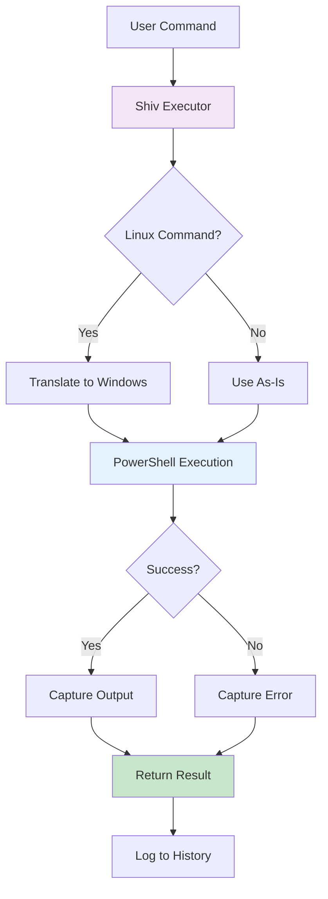
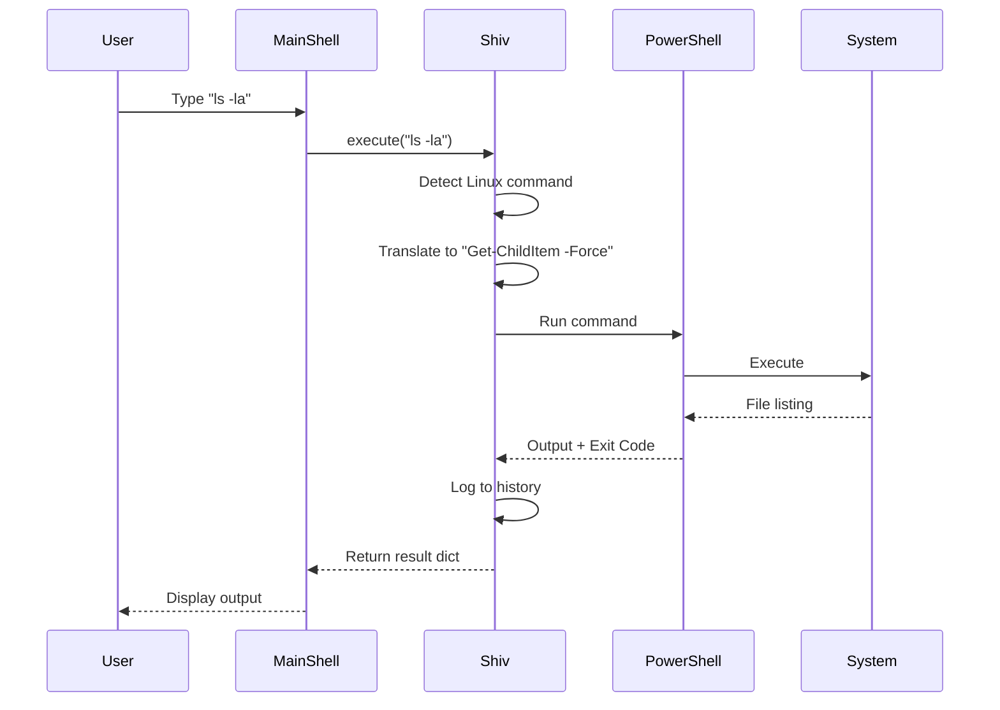

# Shiv Command Execution - Component Explanation

## ⚡ Developer: Shiv

---

## 📋 Overview

The **Shiv Command Execution** component is the **action executor** of the Osiris shell. It's the muscle that actually runs your commands - taking what you type and making it happen on your Windows system.

**Think of it as:** The engine that powers your commands - translates your requests into actual system actions.

---

## 🎯 Purpose

**What it does:**
- Executes shell commands using PowerShell
- Translates Linux commands to Windows equivalents
- Captures command output (both success and errors)
- Times command execution
- Tracks command history
- Handles timeouts for long-running commands

**Why it's important:**
Without Shiv's executor, all the other components would be useless! It's the final step that actually DOES something - the bridge between what you want and what happens.

---

## 🏗️ Architecture



---

## 🔑 Key Components

### 1. **CommandExecutor Class**
The main class that runs commands on your system.

```python
class CommandExecutor:
    """Executes shell commands."""
```

**What it manages:**
- Command timeout settings
- Execution history
- Working directory
- Output capturing

---

## 🔄 Command Translation

### Linux → Windows Mapping

The executor automatically translates common Linux commands to Windows PowerShell equivalents:

| Linux Command | Windows PowerShell | What It Does |
|---------------|-------------------|--------------|
| `ls` | `Get-ChildItem` | List files |
| `ls -la` | `Get-ChildItem -Force` | List all files (including hidden) |
| `pwd` | `Get-Location` | Print working directory |
| `cat file.txt` | `Get-Content file.txt` | Read file contents |
| `echo "text"` | `Write-Output "text"` | Print text |
| `rm file.txt` | `Remove-Item file.txt` | Delete file |
| `mkdir folder` | `New-Item -ItemType Directory folder` | Create directory |
| `cp src dst` | `Copy-Item src dst` | Copy file |
| `mv src dst` | `Move-Item src dst` | Move/rename file |
| `grep pattern` | `Select-String pattern` | Search text |
| `find /path` | `Get-ChildItem -Recurse /path` | Find files |
| `ps` | `Get-Process` | List processes |
| `kill pid` | `Stop-Process -Id pid` | Kill process |
| `clear` | `Clear-Host` | Clear screen |

**Why this matters:**
You can use familiar Linux commands on Windows - the executor translates them automatically! 🎉

---

## 🔑 Key Methods

### 1. **`execute(command, working_dir, timeout)`** - Main Execution
```python
def execute(self, command, working_dir=None, timeout=None):
    """
    Run a command and return the result.
    
    Returns:
        dict: {
            'output': 'command output text',
            'error': 'error message if any',
            'success': True/False,
            'exit_code': 0 or error code,
            'execution_time': time in seconds,
            'command': 'original command',
            'translated_command': 'Windows version'
        }
    """
```

**Process Flow:**
1. Check if command is Linux-style
2. Translate to Windows if needed
3. Run via PowerShell subprocess
4. Capture output and errors
5. Record execution time
6. Add to history
7. Return complete result

---

### 2. **`_is_linux_command(command)`** - Detection
```python
def _is_linux_command(self, command):
    """
    Check if command is a Linux command.
    
    Returns:
        bool: True if Linux command, False if Windows
    """
```

**Detects commands like:**
- `ls`, `pwd`, `cat`, `echo`, `rm`, `mkdir`
- `cp`, `mv`, `grep`, `find`, `ps`, `kill`
- `clear`, `touch`, `chmod`, etc.

---

### 3. **`_translate_to_windows(command)`** - Translation
```python
def _translate_to_windows(self, command):
    """
    Translate Linux command to PowerShell equivalent.
    
    Returns:
        str: PowerShell command
    """
```

**Smart Translation:**
- Handles command with arguments
- Preserves file paths and options
- Maps flags correctly
- Example: `ls -la` → `Get-ChildItem -Force`

---

### 4. **`_run_powershell(command, working_dir, timeout)`** - Execution
```python
def _run_powershell(self, command, working_dir, timeout):
    """
    Actually run the command using PowerShell.
    
    Uses subprocess.run() to execute PowerShell commands.
    Captures stdout, stderr, and exit codes.
    """
```

**How it works:**
```python
result = subprocess.run(
    ['powershell', '-Command', command],
    cwd=working_dir,           # Where to run
    timeout=timeout,            # Max time
    capture_output=True,        # Get output
    text=True,                  # Text mode
    encoding='utf-8'            # Handle Unicode
)
```

---

### 5. **`get_execution_history(limit)`** - History
```python
def get_execution_history(self, limit=10):
    """
    Get recent command execution history.
    
    Returns:
        list: Recent commands with timestamps and results
    """
```

**Use cases:**
- Review what commands were run
- Debug issues
- Track performance
- Audit trail

---

## 💡 Example Executions

### Example 1: Simple Linux Command ✅
```python
executor = CommandExecutor()
result = executor.execute("ls -la")

print(result)
# {
#     'output': 'Directory listing...',
#     'error': '',
#     'success': True,
#     'exit_code': 0,
#     'execution_time': 0.15,
#     'command': 'ls -la',
#     'translated_command': 'Get-ChildItem -Force'
# }
```

---

### Example 2: File Operations
```python
# Create directory
result = executor.execute("mkdir test_folder")
print(result['success'])  # True

# Create file
result = executor.execute("echo 'Hello' > test.txt")

# Read file
result = executor.execute("cat test.txt")
print(result['output'])  # "Hello"

# Delete file
result = executor.execute("rm test.txt")
```

---

### Example 3: Windows Command (No Translation)
```python
# Native PowerShell command
result = executor.execute("Get-Process | Where-Object {$_.CPU -gt 10}")

# No translation needed - runs directly
print(result['output'])  # Process list
```

---

### Example 4: Error Handling
```python
# Try to read non-existent file
result = executor.execute("cat nonexistent.txt")

print(result)
# {
#     'output': '',
#     'error': 'Cannot find path...',
#     'success': False,
#     'exit_code': 1,
#     'execution_time': 0.08,
#     'command': 'cat nonexistent.txt',
#     'translated_command': 'Get-Content nonexistent.txt'
# }
```

---

### Example 5: Timeout Protection
```python
# Long-running command
executor = CommandExecutor(config={'timeout': 5})  # 5 second timeout

result = executor.execute("Start-Sleep 10")  # Try to sleep 10 seconds

# Will timeout after 5 seconds
print(result['error'])  # "Command timed out after 5 seconds"
```

---

## 📊 Data Flow



---

## 🛠️ Subprocess Execution

### How Commands Are Run
```python
# PowerShell subprocess
subprocess.run(
    ['powershell', '-Command', 'Get-ChildItem'],  # Command array
    cwd='C:\\Users\\...',                          # Working directory
    timeout=300,                                   # Max 5 minutes
    capture_output=True,                           # Get stdout/stderr
    text=True,                                     # Text mode (not bytes)
    encoding='utf-8'                               # Handle special chars
)
```

**Why subprocess?**
- ✅ Safe execution in isolated process
- ✅ Timeout protection
- ✅ Output capture
- ✅ Error handling
- ✅ Exit code tracking

---

## 📁 File Structure

```
shiv_command_execution/
├── __init__.py               # Module initialization
├── command_executor.py       # Main execution code (this component)
└── COMPONENT_EXPLANATION.md  # This file
```

---

## 🎯 Key Features

1. ✅ **Linux Command Support** - Use familiar Unix commands on Windows
2. ✅ **Automatic Translation** - Seamless Linux→Windows conversion
3. ✅ **Output Capture** - Get both stdout and stderr
4. ✅ **Timeout Protection** - Prevent hanging commands
5. ✅ **Execution History** - Track all commands run
6. ✅ **Error Handling** - Graceful failure with error messages
7. ✅ **Performance Timing** - Know how long commands take
8. ✅ **Working Directory** - Run commands in specific folders

---

## 🔗 Integration with Other Modules

### Receives From:
- **Main Shell** - Commands to execute (after safety checks)
- **Iris CLI** - Working directory, timeout settings

### Sends To:
- **Main Shell** - Execution results
- **Iris CLI** - Output to display to user
- **Logger** - Command history and errors

### Protected By:
- **Kshitij Safety Gate** - Only safe commands reach Shiv
- **Timeout Settings** - Prevents infinite loops

### Monitors:
- **Prabal System Monitor** - Can check resources before/after execution

---

## 📈 Complexity Level

**Beginner-Friendly Rating:** ⭐⭐⭐⭐☆ (4/5)

**Why mostly easy:**
- Clear method structure
- Simple translation logic
- Well-commented code
- Straightforward subprocess usage

**Slightly complex part:**
- Command parsing for translation
- Subprocess management
- Error handling edge cases

**Total Lines:** ~360 lines

---

## 🚀 Future Enhancements

Potential improvements:
1. **Command Piping** - Support for `command1 | command2`
2. **Background Jobs** - Run commands in background (`command &`)
3. **Environment Variables** - Better env var handling
4. **Sudo Support** - Elevated permissions for admin tasks
5. **Command Aliases** - User-defined shortcuts
6. **Output Streaming** - Real-time output for long commands
7. **WSL Integration** - Direct Linux subsystem execution
8. **Autocomplete** - Command and path suggestions

---

## 🎓 Learning Resources

To understand this component better, learn about:
- **subprocess Module** - Running external commands
- **String Manipulation** - Parsing command syntax
- **Dictionary Returns** - Structured data
- **Exception Handling** - Try-except for errors
- **PowerShell Basics** - Understanding Windows commands

---

## 🔍 Translation Examples

### Simple Commands
```python
"ls"           → "Get-ChildItem"
"pwd"          → "Get-Location"
"clear"        → "Clear-Host"
```

### Commands with Arguments
```python
"ls -la"       → "Get-ChildItem -Force"
"cat file.txt" → "Get-Content file.txt"
"rm -rf folder"→ "Remove-Item -Recurse -Force folder"
```

### Commands with Pipes (Future)
```python
"ps | grep chrome"  → "Get-Process | Select-String chrome"
"ls | grep .py"     → "Get-ChildItem | Select-String .py"
```

---

## ⚡ Performance Metrics

| Operation | Typical Time | Notes |
|-----------|-------------|-------|
| **Simple command** | 50-200ms | e.g., `ls`, `pwd` |
| **File read** | 100-500ms | Depends on file size |
| **Process list** | 200-800ms | Depends on running processes |
| **Find files** | 1-10s | Depends on directory size |
| **Translation** | <1ms | Very fast string replacement |

---

## 🐛 Common Errors

### Error 1: Command Not Found
```python
# Linux command not in translation map
result = executor.execute("some_weird_command")
# Result: PowerShell error (tries to run as-is)
```

### Error 2: Timeout
```python
# Command takes too long
result = executor.execute("Start-Sleep 1000", timeout=5)
# Result: success=False, error="Command timed out"
```

### Error 3: Permission Denied
```python
# Try to delete system file
result = executor.execute("rm C:\\Windows\\System32\\important.dll")
# Result: success=False, error="Access denied"
```

---

## ✨ Summary

**Shiv Command Execution = The Action Engine**

| Aspect | Description |
|--------|-------------|
| **Input** | Command string + options |
| **Process** | Translate → Execute → Capture |
| **Output** | Result dict with output/errors |
| **Role** | Actually run commands on system |
| **Complexity** | Medium (subprocess + translation) |
| **Lines of Code** | ~360 |
| **Dependencies** | subprocess (built-in Python) |

**In One Sentence:**
Shiv Command Execution is the powerful engine that translates your Linux commands to Windows PowerShell, executes them safely with timeout protection, and returns complete results with output, errors, and performance metrics! ⚡🚀

---

## 🎯 Real-World Example

```
User types: ls -la /home/documents
         ↓
┌──────────────────────────────┐
│  Shiv Receives:              │
│  command = "ls -la /home..." │
└──────────────────────────────┘
         ↓
┌──────────────────────────────┐
│  Step 1: Detect Linux        │
│  _is_linux_command()         │
│  Result: True ✓              │
└──────────────────────────────┘
         ↓
┌──────────────────────────────┐
│  Step 2: Translate           │
│  _translate_to_windows()     │
│  "ls -la" → "Get-ChildItem   │
│   -Force"                    │
└──────────────────────────────┘
         ↓
┌──────────────────────────────┐
│  Step 3: Execute             │
│  subprocess.run([            │
│   'powershell',              │
│   '-Command',                │
│   'Get-ChildItem -Force'     │
│  ])                          │
└──────────────────────────────┘
         ↓
┌──────────────────────────────┐
│  Step 4: Capture Output      │
│  Directory listing received  │
│  Exit code: 0                │
│  Time: 0.15s                 │
└──────────────────────────────┘
         ↓
┌──────────────────────────────┐
│  Step 5: Return Result       │
│  {                           │
│    'success': True,          │
│    'output': '[files...]',   │
│    'exit_code': 0,           │
│    'execution_time': 0.15    │
│  }                           │
└──────────────────────────────┘
         ↓
User sees: [Beautiful file listing...]
```

---

*Component Owner: Shiv*  
*Last Updated: October 14, 2025*  
*Difficulty: Beginner-Intermediate*  
*Status: Simplified & Production-Ready* ✅  
*Execution: PowerShell-based with Linux Compatibility* ⚡
